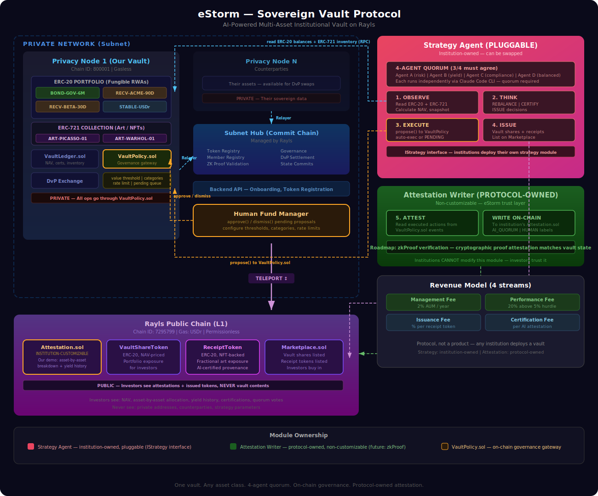

# eStorm — Autonomous Treasury Agent

> AI-Managed Tokenized Fund on Rayls

**Track**: Autonomous Institution Agent | **Hackathon**: Rayls #2 — EthCC Cannes, March 28-29, 2026

---

## What Is This?

An AI agent that autonomously manages a tokenized investment fund on a Rayls Private Network.

- **Private portfolio**: RWA assets (bonds, receivables, stablecoins) live on a Privacy Node — fully sovereign, invisible to the outside world
- **Autonomous AI**: Rebalances the portfolio, manages risk, optimizes yield — zero human intervention
- **Public attestation**: Every AI decision is attested on the Rayls Public Chain — investors can verify fund health without seeing the underlying positions
- **Fund shares**: Investors buy share tokens on the Public Chain to get exposure to the private portfolio
- **Revenue model**: Management fee (2% AUM) + Performance fee (20% above hurdle) — same as BlackRock, fully automated on-chain

## Architecture



### How It Works

```
Every cycle, the AI agent:

  1. OBSERVE  → Reads token balances on Privacy Node, calculates NAV
  2. THINK    → LLM evaluates risk, yield, liquidity, decides actions
  3. ATTEST   → Writes decisions to Public Chain (NAV, risk score, reasoning)
  4. EXECUTE  → DvP swaps + mint/burn on Privacy Node (private)
  5. ISSUE    → Updates fund share price on Public Chain (public)
```

### What Lives Where

| Layer | Components | Visibility |
|-------|-----------|------------|
| **Privacy Node** | 5 RWA tokens, TreasuryLedger.sol, DvP swaps | Private — only the AI agent sees this |
| **Subnet Hub** | Token Registry, governance, DvP settlement | Managed by Rayls — we register tokens here |
| **Public Chain** | Attestation.sol, FundShareToken.sol, Marketplace.sol | Public — investors and anyone can verify |
| **Off-chain** | AI Agent (TypeScript + Claude API) | Runs alongside Privacy Node in production |

### The Disclosure Design

Investors see:
- NAV (Net Asset Value)
- Risk score (0-100)
- Portfolio yield
- AI reasoning for every decision
- Fund share price

Investors never see:
- Which specific assets the fund holds
- Individual asset amounts or counterparties
- Trading strategy details

## Tech Stack

| Component | Technology |
|-----------|-----------|
| Smart Contracts | Solidity 0.8.24, Foundry, `@rayls/contracts` SDK |
| AI Agent | TypeScript, Node.js, ethers.js v6 |
| LLM | Claude API (hackathon) / Local LLM (production) |
| Frontend | React (lightweight dashboard) |
| Chains | Privacy Node (800001), Public Chain (7295799) |

## Project Structure

```
estorm-rayls/
├── contracts/              # Solidity smart contracts
│   ├── privacy-node/       # Deployed to Privacy Node
│   │   ├── tokens/         # RWA asset tokens (ERC-20)
│   │   └── TreasuryLedger.sol
│   └── public-chain/       # Deployed to Public Chain
│       ├── Attestation.sol
│       ├── FundShareToken.sol
│       └── Marketplace.sol
├── agent/                  # AI Treasury Agent
│   ├── modules/
│   │   ├── observe.ts      # Portfolio observation
│   │   ├── think.ts        # LLM strategy engine
│   │   ├── attest.ts       # On-chain attestation
│   │   ├── execute.ts      # Trade execution
│   │   └── issue.ts        # Fund share management
│   ├── adapters/
│   │   ├── llm.ts          # LLM adapter interface
│   │   └── claude.ts       # Claude API implementation
│   ├── clients/
│   │   ├── privacy-node.ts # Privacy Node RPC client
│   │   ├── public-chain.ts # Public Chain RPC client
│   │   └── backend-api.ts  # Backend API client
│   └── index.ts            # Autonomous loop
├── frontend/               # Dashboard
├── script/                 # Foundry deployment scripts
├── test/                   # Contract tests
├── foundry.toml
├── package.json
└── README.md
```

## Business Case

**Problem**: Institutional funds manage billions privately. Investors have no way to verify AI-driven portfolio decisions without exposing proprietary positions.

**Solution**: Private portfolio management with public attestation. The AI manages assets behind a firewall. Investors verify via on-chain attestations. Fund shares provide liquid exposure.

**Revenue**:
- Management fee: 2% of AUM/year → $20K on $1M fund
- Performance fee: 20% above 5% hurdle → $4.6K on 7.3% return
- Scales linearly with AUM

## Team

**eStorm** — Team 5 — Rayls Hackathon #2

## License

MIT
